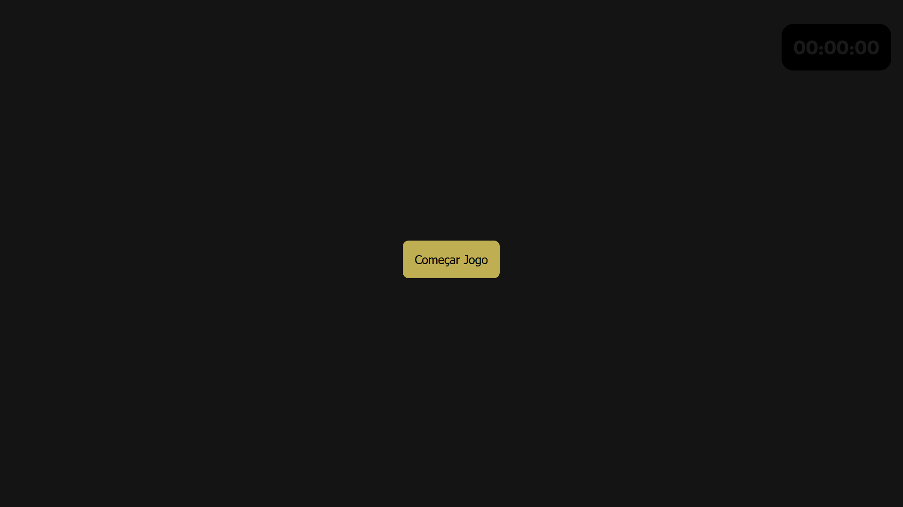
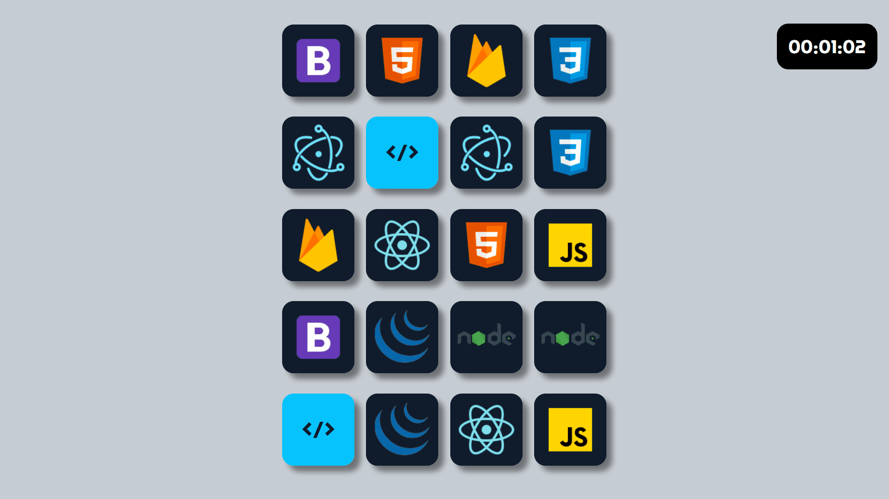

<h1 align="center">Jogo da Memoria</h1>

Jogo da memória de algumas tecnologias da programação.

<h3 align="center"><a src="https://mienblack.github.io/jogo-da-memoria/"><strong>[ JOGUE AGORA ]</strong></a></h3>

---

 

  
  
  

## Tecnologias

As seguintes ferramentas foram usadas na construção do projeto:

- [Javascript]
- [HTML]
- [CSS]

Made with 💟 by Damien Costa ✌🏿

